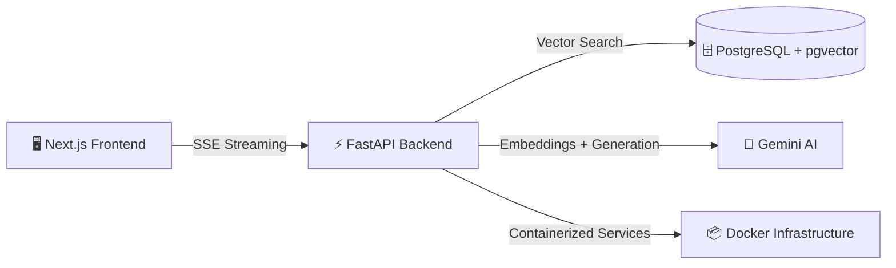

# ⚡ Commerce AI — Agentic Intelligence Platform

<div align="center">

### 🧠 The Future of Intelligent Commerce Experiences

*An enterprise-grade AI shopping workspace powered by autonomous agents, semantic retrieval, and real-time generative intelligence.*

<br/>


<br/>


</div>

---

# ✨ Overview

Commerce AI is a next-generation **agentic commerce intelligence platform** designed to reinvent how users discover, compare, and evaluate products online.

Built with a **decoupled microservice architecture**, **real-time streaming AI**, and **vector-powered semantic retrieval**, the platform delivers deeply contextual shopping experiences that feel conversational, intelligent, and personalized.

> ⚡ Think ChatGPT + Amazon + AI Analysts — in one unified workspace.

---

# 🔥 Core Features

<table>
<tr>
<td width="50%">

## 🤖 Agentic Chat Workspace
Real-time conversational shopping powered by streaming AI responses and structured product payloads using **Server-Sent Events (SSE)**.

</td>
<td width="50%">

## 🔍 Semantic Vector Search
Leverages `pgvector` + Gemini embeddings to understand **intent**, not just keywords.

</td>
</tr>

<tr>
<td width="50%">

## 🧠 Deep Spec Comparison Engine
AI-driven side-by-side analysis that identifies:
- Feature differences
- Performance advantages
- Clear winners
- Buying recommendations

</td>
<td width="50%">

## 💬 Review Intelligence
Synthesizes hundreds of customer reviews into:
- Sentiment summaries
- Top praises
- Common complaints
- Purchase confidence insights

</td>
</tr>

<tr>
<td width="50%">

## ✨ Premium Glassmorphic UI
Modern responsive interface built with:
- Tailwind CSS
- Lucide Icons
- Next.js App Router
- Framer-inspired interactions

</td>
<td width="50%">

## ⚡ Streaming AI Architecture
Simultaneous streaming of:
- AI-generated responses
- Structured JSON product cards
- Comparison metadata
- Insights payloads

</td>
</tr>
</table>

---

# 🏗️ System Architecture



---

# 🧰 Tech Stack

## 🎨 Frontend
- **Next.js 15**
- **React**
- **Tailwind CSS**
- **Server-Sent Events**
- **Lucide Icons**

## ⚙️ Backend
- **Python**
- **FastAPI**
- **SQLAlchemy Async**
- **Uvicorn**

## 🗄 Database
- **PostgreSQL**
- **pgvector Extension**

## 🧠 AI Layer
- `gemini-2.0-flash`
- `gemini-embedding-001`

## 🚀 Infrastructure
- **Docker**
- **Docker Compose**

---

# 🚀 Quickstart

## 1️⃣ Prerequisites

Ensure the following tools are installed:

| Tool | Version |
|------|----------|
| Node.js | `18+` |
| Docker Desktop | Latest |
| PostgreSQL | Optional |
| Gemini API Key | Required |

---

# 🔐 Environment Variables

Create a `.env` file inside `backend/`

```env
GEMINI_API_KEY=your_google_api_key_here

EMBED_MODEL=gemini-embedding-001
MAIN_MODEL=gemini-2.0-flash

DATABASE_URL=postgresql+asyncpg://postgres:postgres@db:5432/commerce
```

---

# 🐳 Start Backend Services

```bash
docker-compose up --build backend db
```

### Backend available at:
```bash
http://localhost:8000
```

---

# 💻 Start Frontend

```bash
cd frontend

npm install

npm run dev
```

### Frontend available at:
```bash
http://localhost:3000
```

---

# 🔌 API Endpoints

| Method | Endpoint | Description |
|--------|----------|-------------|
| `POST` | `/api/v1/chat/stream` | Streams AI responses + product JSON |
| `GET` | `/api/v1/products/compare` | AI-powered product comparison |
| `GET` | `/api/v1/products/{id}/insights` | Review sentiment synthesis |

---

# 🧠 AI Capabilities

## Semantic Retrieval Pipeline

```txt
User Query
    ↓
Gemini Embeddings
    ↓
pgvector Similarity Search
    ↓
Context Retrieval
    ↓
LLM Reasoning
    ↓
Streaming AI Response
```

---

# 📸 Platform Highlights

```diff
+ Real-time AI streaming
+ Semantic search with vector embeddings
+ Deep product intelligence
+ RAG-powered recommendations
+ Production-grade FastAPI backend
+ Modern App Router architecture
+ Fully containerized infrastructure
```

---

# 📁 Project Structure

```bash
commerce-ai/
│
├── frontend/              # Next.js App
├── backend/               # FastAPI Services
│
├── docker-compose.yml
├── README.md
│
└── docs/
```

---

# 🌌 Vision

Commerce AI pushes beyond traditional e-commerce interfaces by introducing:

- Autonomous AI shopping workflows
- Retrieval-Augmented product reasoning
- Real-time conversational commerce
- Intelligent review synthesis
- AI-native comparison systems

The goal is simple:

> Build the operating system for AI-powered commerce experiences.

---

# 🛠 Future Roadmap

- [ ] Multi-agent orchestration
- [ ] Voice-enabled commerce
- [ ] AI memory + personalization
- [ ] Live inventory integrations
- [ ] Multimodal product understanding
- [ ] Autonomous purchase workflows

---

# 🤝 Contributing

Contributions, ideas, and improvements are welcome.

```bash
git clone your-repo-url

# Create a branch
git checkout -b feature/amazing-feature
```

---

# ⭐ Support the Project

If you like this project, consider giving it a ⭐ on GitHub — it helps a lot.

<div align="center">

### ⚡ Built for the Future of Commerce


</div>
